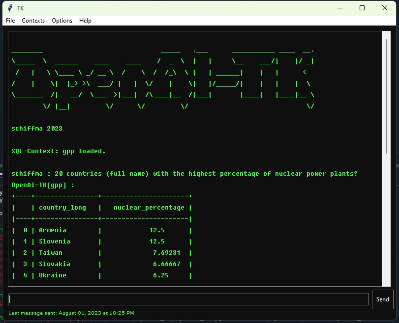

# OpenAI_DB



Python program using the OpenAI-API to create SQL-statements based on a context given and execute them on a default database.

Currently there are two configured topics as examples:

* gpp
  [GPP](https://datasets.wri.org/dataset/globalpowerplantdatabase), a comprehensive, global, open source database of power plants.

* gwr_ch_nfs
   [GWR](https://www.housing-stat.ch/de/madd/public.html) Swiss data set, a data set about all entrances, buildings and dwellings according to official registration in Switzerland (compiled by the Swiss Federal Statistical Office).

The scripts ``load_GWR_PLZ_from_csv_duckdb.py`` and ``load_Global_Power_Plants_from_csv_duckdb.py`` will download the data and convert the .csv-feeds to a fast relational [DuckDB database](https://duckdb.org/) for each topic.

Context for each topic is given in [data](https://github.com/schiffma/OpenAI_DB/blob/main/data), this will be loaded once on the beginning of the ```openai.ChatCompletion``` session.

## Setup

1. If you don’t have Python installed, [install it from here](https://www.python.org/downloads/).

2. Clone this repository.

3. Navigate into the project directory:

   ```bash
   $ cd OpenAI_DB
   ```

4. Install the requirements:

   ```bash
   $ pip install -r requirements.txt
   ```

5. Add your [OpenAI API key](https://platform.openai.com/account/api-keys) to the newly created `.env` file.

   ```
   OPENAI_API_KEY=<your OpenAI API key>
   ```

6. Create the GWR-DuckDB databases:

   ```bash
   $ python load_Global_Power_Plants_from_csv_duckdb.py
   $ python load_GWR_PLZ_from_csv_duckdb.py
   ```
7. Set the topic ("gpp" or "gwr_ch_bfs") in openai_sql_duckdb.py
    `` context = "gpp" ``
   
8. Run the app:

   ```bash
   $ python openai_sql_duckdb.py
   ```
   
## Examples

The following examples consist of questions formulated in English and German and their answers/results as tabulated dataframes and the generated SQL-statements 
used to generate them.

```
Question: 10 locations with the highest percentage of hotels?
prompt_tokens:  1495
total_tokens:  1707
>> Runtime of OpenAI: 13.92 second.

>> Total Runtime of eval_sql: 0.10 second.

ChatGPT[gwr_ch_bfs_duck.db]: 
+----+--------------------+--------------------+
|    | DPLZNAME           |   hotel_percentage |
|----+--------------------+--------------------|
|  0 | Serpiano           |           40       |
|  1 | Jungfraujoch       |           33.3333  |
|  2 | Bürgenstock        |           23.5955  |
|  3 | Kleine Scheidegg   |           19.2308  |
|  4 | Vulpera            |           15.873   |
|  5 | Alp Grüm           |           12.5     |
|  6 | Samnaun Dorf       |           12.2995  |
|  7 | Acquarossa         |           11.9048  |
|  8 | Sils/Segl Baselgia |           10.5263  |
|  9 | Zermatt            |            9.56194 |
+----+--------------------+--------------------+
WITH hotel_count AS (
    SELECT ENTRANCE.DPLZNAME, COUNT(*) AS total_hotels
    FROM BUILDING
    JOIN ENTRANCE ON BUILDING.EGID = ENTRANCE.EGID
    JOIN CODES ON BUILDING.GKLAS = CODES.CECODID
    WHERE CODES.CODTXTLD = 'Hotelgebäude'
    GROUP BY ENTRANCE.DPLZNAME
),
total_buildings AS (
    SELECT ENTRANCE.DPLZNAME, COUNT(*) AS total
    FROM BUILDING
    JOIN ENTRANCE ON BUILDING.EGID = ENTRANCE.EGID
    GROUP BY ENTRANCE.DPLZNAME
)
SELECT hotel_count.DPLZNAME, (hotel_count.total_hotels::decimal / total_buildings.total::decimal) * 100 AS hotel_percentage
FROM hotel_count
JOIN total_buildings ON hotel_count.DPLZNAME = total_buildings.DPLZNAME
ORDER BY hotel_percentage DESC
LIMIT 10;

> Total Runtime of open_ai_sql: 14.02 second.

Question: 10 orte mit dem höchsten hotelanteil prozentual?
prompt_tokens:  1237
total_tokens:  1458
>> Runtime of OpenAI: 12.88 second.

>> Total Runtime of eval_sql: 0.25 second.

ChatGPT[gwr_ch_bfs_duck.db]: 
+----+--------------------+--------------------+
|    | city               |   hotel_percentage |
|----+--------------------+--------------------|
|  0 | Serpiano           |           40       |
|  1 | Jungfraujoch       |           33.3333  |
|  2 | Bürgenstock        |           23.5955  |
|  3 | Kleine Scheidegg   |           19.2308  |
|  4 | Vulpera            |           15.873   |
|  5 | Alp Grüm           |           12.5     |
|  6 | Samnaun Dorf       |           12.2995  |
|  7 | Acquarossa         |           11.9048  |
|  8 | Sils/Segl Baselgia |           10.5263  |
|  9 | Zermatt            |            9.56194 |
+----+--------------------+--------------------+
WITH total_buildings AS (
    SELECT ENTRANCE.DPLZNAME AS city, COUNT(*) AS total
    FROM BUILDING
    JOIN ENTRANCE ON BUILDING.EGID = ENTRANCE.EGID
    GROUP BY ENTRANCE.DPLZNAME
),
hotel_buildings AS (
    SELECT ENTRANCE.DPLZNAME AS city, COUNT(*) AS hotels
    FROM BUILDING
    JOIN ENTRANCE ON BUILDING.EGID = ENTRANCE.EGID
    JOIN CODES ON BUILDING.GKLAS = CODES.CECODID
    WHERE CODES.CODTXTLD = 'Hotelgebäude' AND CODES.CMERKM = 'GKLAS'
    GROUP BY ENTRANCE.DPLZNAME
)
SELECT hotel_buildings.city, (hotel_buildings.hotels::decimal / total_buildings.total::decimal) * 100 AS hotel_percentage
FROM hotel_buildings
JOIN total_buildings ON hotel_buildings.city = total_buildings.city
ORDER BY hotel_percentage DESC
LIMIT 10;

> Total Runtime of open_ai_sql: 13.13 second.

Question: 5 cantons with the oldest buildings on average?
prompt_tokens:  1228
total_tokens:  1330
>> Runtime of OpenAI: 4.49 second.

>> Total Runtime of eval_sql: 0.02 second.

ChatGPT[gwr_ch_bfs_duck.db]: 
+----+----------+---------------+
|    | Canton   |   Average_Age |
|----+----------+---------------|
|  0 | BS       |       83.8977 |
|  1 | AI       |       81.0066 |
|  2 | OW       |       78.9827 |
|  3 | VD       |       72.401  |
|  4 | GR       |       69.0565 |
+----+----------+---------------+
WITH avg_age AS (
    SELECT 
        BUILDING.GDEKT AS Canton,
        AVG(EXTRACT(YEAR FROM CURRENT_DATE) - BUILDING.GBAUJ) AS Average_Age
    FROM 
        BUILDING
    WHERE 
        BUILDING.GBAUJ IS NOT NULL
    GROUP BY 
        BUILDING.GDEKT
)
SELECT 
    Canton,
    Average_Age
FROM 
    avg_age
ORDER BY 
    Average_Age DESC
LIMIT 5;

> Total Runtime of open_ai_sql: 4.51 second.

Question: 5 kantone mit den durchschnittlich ältesten Gebäude?
prompt_tokens:  1230
total_tokens:  1480
>> Runtime of OpenAI: 16.10 second.

>> Total Runtime of eval_sql: 0.08 second.

ChatGPT[gwr_ch_bfs_duck.db]: 
+----+----------+----------------------------+
|    | Kanton   |   Durchschnittliches_Alter |
|----+----------+----------------------------|
|  0 | BS       |                    83.8977 |
|  1 | AI       |                    81.0066 |
|  2 | OW       |                    78.9827 |
|  3 | VD       |                    72.401  |
|  4 | GR       |                    69.0565 |
+----+----------+----------------------------+
SELECT 
    BUILDING.GDEKT AS Kanton, 
    AVG(EXTRACT(YEAR FROM CURRENT_DATE) - BUILDING.GBAUJ) AS Durchschnittliches_Alter
FROM 
    BUILDING
WHERE 
    BUILDING.GBAUJ IS NOT NULL
GROUP BY 
    BUILDING.GDEKT
ORDER BY 
    Durchschnittliches_Alter DESC
LIMIT 5;

> Total Runtime of open_ai_sql: 16.19 second.

```
